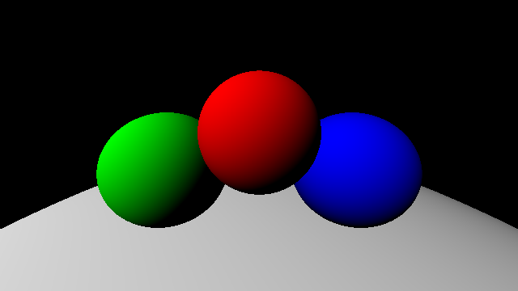

# Simple Raytracer

> A simple raytracer written in OCaml

## Show me a sample image!

## Quickstart

Run `make`, and `./SimpleRaytracer.native | display -` to look at the result.

## Not-so-quick start

Read `./SimpleRaytracer.ml`, then make changes (if any), then do steps in quickstart

## License

[Unlicense](LICENSE)
